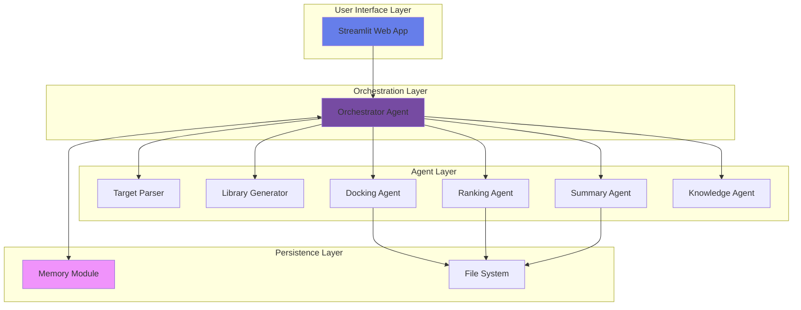

# 🧬 Virtual Screening System

<div align="center">

[](https://www.python.org/downloads/)
[](https://streamlit.io)
[](https://opensource.org/licenses/MIT)
[](https://huggingface.co/spaces/yourusername/virtual-screening)
[](http://makeapullrequest.com)
[](https://github.com/psf/black)

<h3>AI-Powered Multi-Agent System for Drug Discovery Virtual Screening</h3>

[Demo](https://huggingface.co/spaces/yourusername/virtual-screening) • 
[Documentation](#-documentation) • 
[Installation](#-installation) • 
[Features](#-features) • 
[Contributing](#-contributing)


</div>

---

## 🌟 Overview

The **Virtual Screening System** is an advanced multi-agent AI workflow that simulates a drug discovery pipeline. Built with a modular architecture, it demonstrates intelligent orchestration, adaptive workflows, and memory persistence - all essential components of modern AI systems.

### 🎯 Key Highlights

- **🤖 8 Specialized AI Agents** working in harmony
- **🧠 Intelligent Orchestration** with adaptive workflow management
- **💾 Memory Persistence** for context-aware operations
- **📊 Interactive Visualizations** with real-time updates
- **🚀 Cloud-Ready** deployment on Hugging Face Spaces
- **📚 Built-in Knowledge Base** for chemistry Q&A

## 🏗️ Architecture



## ✨ Features

### 🔬 Virtual Screening Pipeline
- **Target Validation**: Accepts protein names or PDB IDs
- **Molecule Generation**: Creates mock SMILES libraries up to 30 compounds
- **Mock Docking**: Deterministic scoring simulation (-4 to -10 range)
- **Smart Ranking**: Identifies top drug candidates
- **Automated Reports**: Professional markdown summaries

### 🧠 Intelligent Features
- **Adaptive Workflows**: Dynamically adjusts pipeline based on input
- **Memory System**: Remembers context across sessions
- **Knowledge Base**: Instant answers to chemistry/pharma questions
- **Custom Input Support**: Upload your own SMILES libraries

### 📊 Data Visualization
- Docking score distributions
- Top compounds analysis
- Interactive scatter plots
- Downloadable results (CSV, Markdown)

## 🚀 Installation

### Prerequisites
- Python 3.8 or higher
- pip package manager
- 500MB free disk space

### Local Development

```bash
# Clone the repository
git clone https://github.com/yourusername/virtual-screening-system.git
cd virtual-screening-system

# Create virtual environment
python -m venv venv

# Activate virtual environment
# On Windows:
venv\Scripts\activate
# On macOS/Linux:
source venv/bin/activate

# Install dependencies
pip install -r requirements.txt

# Run the application
streamlit run app.py
```

The app will open in your browser at `http://localhost:8501`

### 🤗 Deploy to Hugging Face Spaces

<details>
<summary>Click for deployment instructions</summary>

1. **Fork this repository**

2. **Create a new Space on Hugging Face**
   ```
   https://huggingface.co/spaces → New Space
   ```

3. **Configure Space Settings**
   - Space name: `virtual-screening-system`
   - SDK: `Streamlit`
   - SDK version: `1.32.0`
   - Hardware: `CPU Basic` (free tier)

4. **Connect GitHub Repository**
   ```bash
   git remote add space https://huggingface.co/spaces/YOUR_USERNAME/virtual-screening-system
   git push space main
   ```

5. **Your app is live!** 🎉
   ```
   https://huggingface.co/spaces/YOUR_USERNAME/virtual-screening-system
   ```

</details>

## 💻 Usage

### Web Interface

#### 1. Virtual Screening Mode
```python
# Select target protein
Target: "EGFR" or "1A4G"

# Configure library
Library Size: 20 molecules

# Run screening
→ Generates docking results
→ Ranks top compounds
→ Creates summary report
```

#### 2. Knowledge Query Mode
```python
# Ask chemistry questions
"What is Lipinski's Rule of 5?"
"Explain ADMET properties"
"What is molecular docking?"
```

#### 3. Memory Management
```python
# System remembers:
- Last target protein
- Previous library size
- Session history
```

### Command Line Interface

```bash
# Create query file
echo '{"target": "EGFR", "library_size": 20}' > query.json

# Run orchestrator
python orchestrator.py --query query.json

# Output files
├── docking_results.csv
├── top_hits.csv
└── summary.md
```

### Python API

```python
from orchestrator import OrchestratorAgent

# Initialize system
orchestrator = OrchestratorAgent()

# Run screening
query = {
    "target": "EGFR",
    "library_size": 20,
    "top_n": 5
}

results = orchestrator.process_query(query)

# Access results
top_hits = results['results']['top_hits']
best_score = results['results']['best_score']
```

## 📁 Project Structure

```
virtual-screening-system/
│
├── 📂 agents/                    # Agent modules
│   ├── base_agent.py            # Base agent class
│   ├── target_parser_agent.py   # Protein validation
│   ├── library_generator_agent.py # Molecule generation
│   ├── docking_agent.py         # Docking simulation
│   ├── ranking_agent.py         # Result ranking
│   ├── summary_agent.py         # Report generation
│   ├── knowledge_agent.py       # Q&A system
│   └── memory_module.py         # Session persistence
│
├── 📄 orchestrator.py           # Main orchestrator
├── 🎨 app.py                   # Streamlit interface
├── 📋 requirements.txt         # Dependencies
├── 🧪 test_system.py          # Test suite
├── 📚 README.md               # Documentation
└── 📦 examples/               # Sample queries
```

## 🧪 Testing

```bash
# Run all tests
python test_system.py

# Test individual components
python -m pytest tests/test_agents.py -v

# Test with coverage
python -m pytest --cov=agents tests/
```

### Test Coverage
- ✅ Agent initialization
- ✅ Workflow orchestration
- ✅ Memory persistence
- ✅ Knowledge queries
- ✅ File generation

## 📊 Performance

| Metric | Value |
|--------|-------|
| Startup Time | < 3 seconds |
| Screening Time (20 molecules) | < 1 second |
| Memory Usage | < 100 MB |
| Supported Library Size | Up to 30 molecules |
| Knowledge Base Topics | 10+ concepts |

## 🤝 Contributing

We welcome contributions! Please see our [Contributing Guidelines](CONTRIBUTING.md).

### Development Setup

```bash
# Install development dependencies
pip install -r requirements-dev.txt

# Run linting
black agents/ orchestrator.py app.py
flake8 agents/ orchestrator.py app.py

# Run type checking
mypy agents/ orchestrator.py
```

### Adding New Agents

1. Create new agent class inheriting from `BaseAgent`
2. Implement `execute()` method
3. Register in orchestrator
4. Add tests

Example:
```python
from agents.base_agent import BaseAgent

class ADMETAgent(BaseAgent):
    def __init__(self):
        super().__init__(
            name="ADMETAgent",
            description="Predicts ADMET properties"
        )
    
    def execute(self, input_data):
        # Implementation here
        return results
```

## 📈 Roadmap

- [x] Core multi-agent system
- [x] Streamlit interface
- [x] Memory persistence
- [x] Knowledge base
- [ ] Real molecular docking integration
- [ ] LLM-powered orchestration
- [ ] ADMET prediction agent
- [ ] Retrosynthesis agent
- [ ] REST API endpoints
- [ ] Database integration
- [ ] Multi-user support
- [ ] Advanced ML scoring

## 📄 License

This project is licensed under the MIT License - see the [LICENSE](LICENSE) file for details.

## 🙏 Acknowledgments

- Built with [Streamlit](https://streamlit.io/) for the web interface
- Inspired by modern drug discovery pipelines
- Multi-agent architecture patterns from [LangChain](https://langchain.com/)
- Molecular representations using SMILES notation

## 📚 Documentation

### Agent Specifications

<details>
<summary>Click to expand agent details</summary>

#### Target Parser Agent
- Validates 4-character PDB IDs
- Maps protein names to PDB IDs
- Database of 10+ common drug targets

#### Library Generator Agent
- 30+ diverse SMILES structures
- Random sampling without replacement
- Support for custom SMILES input

#### Docking Agent
- Deterministic hash-based scoring
- Score range: -4 to -10 (lower = better)
- Reproducible results

#### Ranking Agent
- Sorts by docking scores
- Configurable top-N selection
- Statistical analysis

#### Summary Agent
- Markdown report generation
- Timestamp and metadata
- Recommendations

#### Knowledge Agent
- 10+ chemistry/pharma topics
- Instant responses
- Expandable knowledge base

#### Memory Module
- JSON-based persistence
- Session history tracking
- Context-aware operations

</details>

## ⚠️ Disclaimer

> **Note**: This is a **mock simulation** for demonstration and educational purposes. It does not perform actual molecular docking or provide real drug discovery insights. For actual drug discovery, use specialized tools like AutoDock Vina, Schrödinger Suite, or similar professional platforms.

## 📞 Support

- 🐛 [Report Issues](https://github.com/yourusername/virtual-screening-system/issues)
- 💬 [Discussions](https://github.com/yourusername/virtual-screening-system/discussions)
- 📧 Contact: your.email@example.com
- 🐦 Twitter: [@yourusername](https://twitter.com/yourusername)

## 🌟 Star History

[](https://star-history.com/#yourusername/virtual-screening-system&Date)

## 📈 Contributors

<!-- ALL-CONTRIBUTORS-LIST:START -->
<table>
  <tr>
    <td align="center">
      <a href="https://github.com/yourusername">
        
        <br />
        <sub><b>Your Name</b></sub>
      </a>
      <br />
      <a href="#" title="Code">💻</a>
      <a href="#" title="Documentation">📖</a>
      <a href="#" title="Design">🎨</a>
    </td>
  </tr>
</table>
<!-- ALL-CONTRIBUTORS-LIST:END -->

---

<div align="center">

**If you find this project useful, please consider giving it a ⭐!**

Made with ❤️ for advancing AI in Drug Discovery

[Back to Top](#-virtual-screening-system)

</div>
